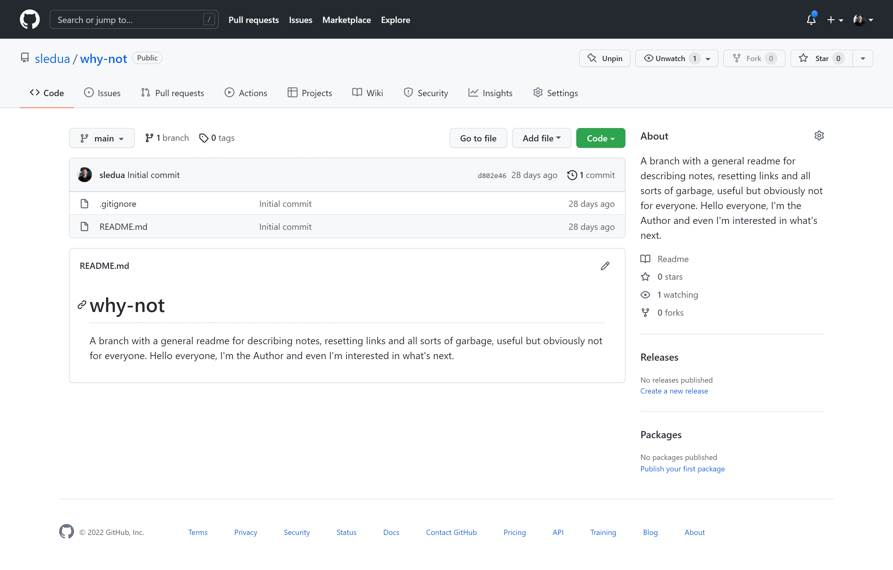

# Name App

This example is just a fish text, for demonstration. I will usually delete it and replace it with the one that answers, the task description.
This is a solution to the [Name App](https://github.com/sledua/why-not). Frontend Mentor challenges help you improve your coding skills by building realistic projects. 

### Screenshot

### Links

- Solution URL: [Repo](https://github.com/sledua/why-not)
- Live Site URL: [Live GH-pages](https://github.com/sledua/why-not)
### Built with

**Note: [MDB](https://mdb.pushkaryadav.in/generate) - Markdown Badges - Super cool badges for your projects**  
 
 
 
<b>[Back](README.md)<b/>